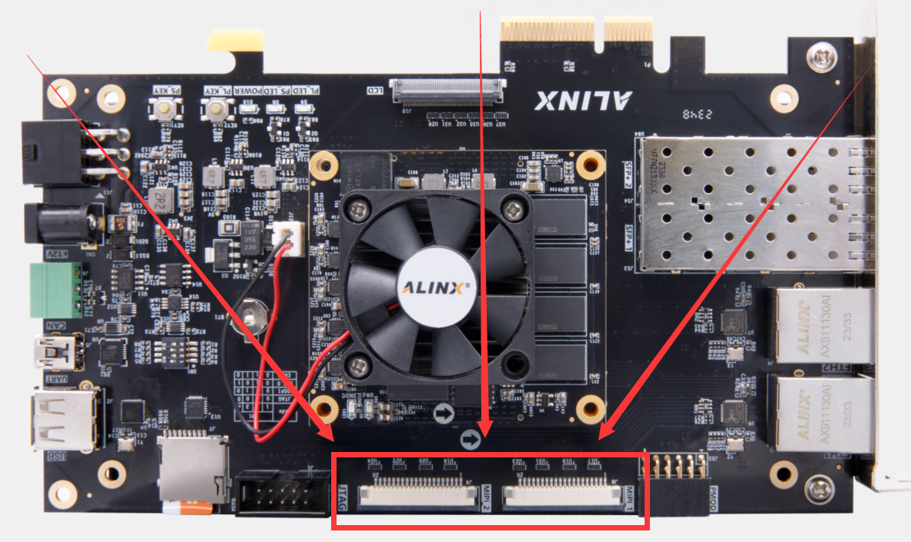
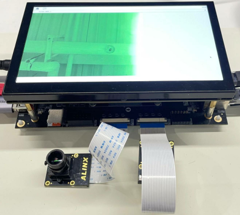

# MIPI摄像头
- MIPI摄像头接口在VD100开发板的这个位置:
 
- 接上MIPI摄像头后状态如下:

---
## 在开发板Linux系统中显示MIPI摄像头
- STEP1:系统启动并登录后，调用初始化脚本初始化MIPI摄像头相关的IP：\
`cd ~/test_apps/ && sudo ./mipi_init.sh && cd ~` 
 
- STEP2:运行 *sudo ~/test_apps/mipi_senser0_show* 程序显示MIPI1摄像头 \
 \

- STEP3:运行 *sudo ~/test_apps/mipi_senser1_show* 程序显示MIPI2摄像头 \
 \
 

PS:*mipi_senserx_show* 程序源码在[这里](../../applications/qtProject/mipi_camera)。关于如何使用QTCreator编译这个程序，请参考 [4_安装QT库和OPENCV库以及在QTCreator中设置编译环境.md](./4_安装QT库和OPENCV库以及在QTCreator中设置编译环境.md)

---
### 也可以在MatchBox桌面上用鼠标来运行这些程序。
- STEP1:单击 *File Manager PC...* 图标: \
 
- 双击文件夹进入到程序所在的路径: \
 
- 双击程序以运行，弹窗后单机右下角的 *Execute* 按钮: \

- 程序执行: \

---
---
- 访问[ALINX官方网站](https://www.alinx.com)以获取更多信息。
