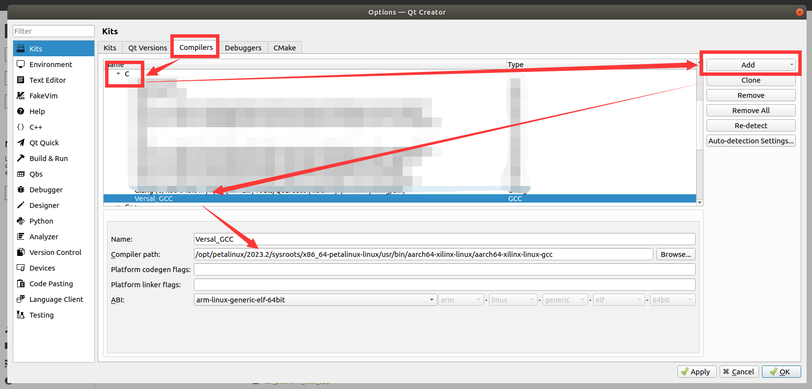
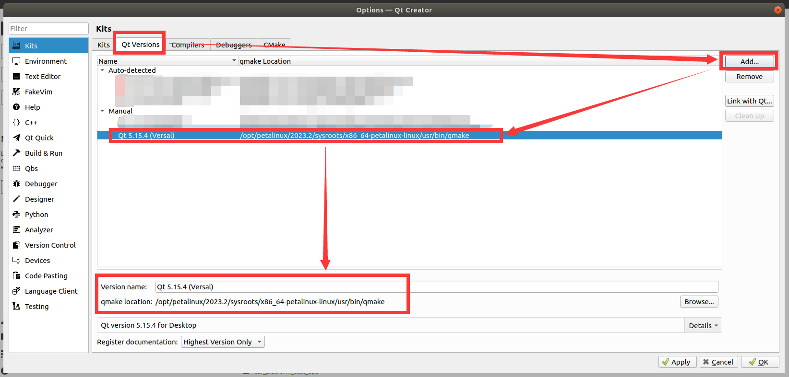

# Install QT and OPENCV libraries and set up the compilation environment in QTCreator
## Install QT and OPENCV libraries
- After the Petalinux project is compiled, execute the command: `petalinux-build --sdk` to obtain sdk.sh. Compiling sdk.h is time-consuming. You can download our compiled [sdk.sh](http://www.alinx.vip:81/extra_support%2F2023_2_sdk_sh%2Fsdk.sh). Copy sdk.sh to the Ubuntu system where QTCreator is located, open the terminal in the path where sdk.sh is located, and execute the command:
`chmod +x ./sdk.sh && ./sdk.sh`

- Prompt to enter the installation path. Here I use the default path to install. After the installation is completed, you can see these files in the corresponding path:\

- Decompress [opencv4_include.tar.gz](../../libs/opencv4_include.tar.gz), and recursively replace the decompressed *opencv4* folder with the folder of the same name in the path below:\

---
## Set up the compilation environment in QTCreator

- Open QTCreator, click *Tools* in the upper menu bar, and select *Options*:

- Use the library obtained from the sdk.sh installed previously to add a *Kits*:
\
\
\
\
\
Click OK to save the settings.
- Open a QT project, take [mipi_camera](../../applications/qtProject/mipi_camera) as an example:\
\

- Select Versal Kits to compile:\

- You can see the executable file in the compilation result path\

---
---
- Visit [ALINX official website](https://www.alinx.com) for more information.

